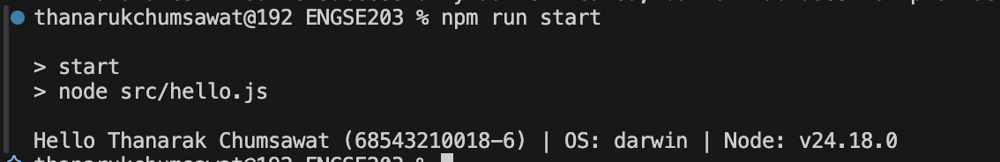
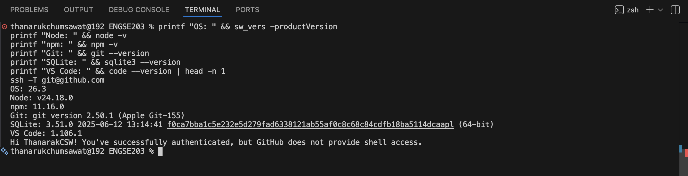

# หลักฐานการปฏิบัติการ (Lab 01 Evidence)

## รายการหลักฐานผลการทำงาน (Screenshots)

### 1. ผลการรันโปรแกรมและการตรวจสอบสภาพแวดล้อม (`resultlab1_1.png`)
แสดงผลการรันโปรแกรมผ่านคำสั่ง `npm run start` (เรียกใช้ `src/hello.js`) ซึ่งแสดงข้อมูลผู้จัดทำ, ระบบปฏิบัติการ (macOS/darwin) และเวอร์ชัน Node.js ในเครื่อง

---

### 2. การจัดเตรียม Git และการ Push งานขึ้น GitHub (`resultlab1_2.png`)
แสดงคำสั่งและผลการทำ Git Workflow การเพิ่มไฟล์, การ Commit และการ Push ขึ้น Remote Repository บน GitHub

