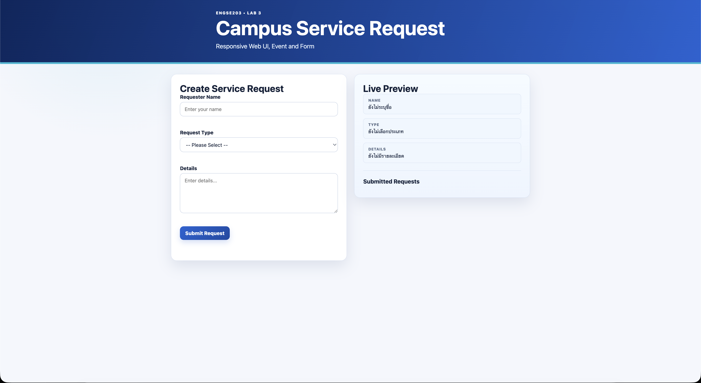
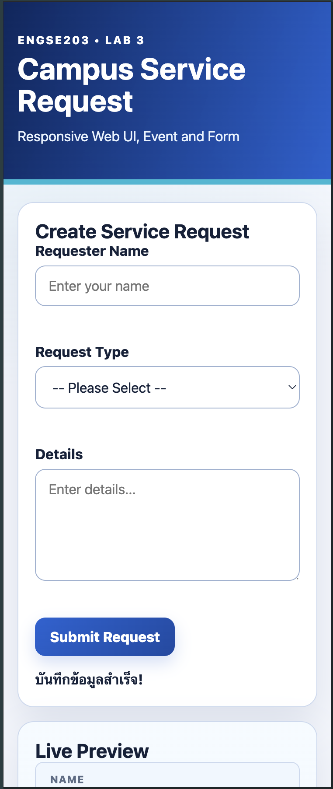
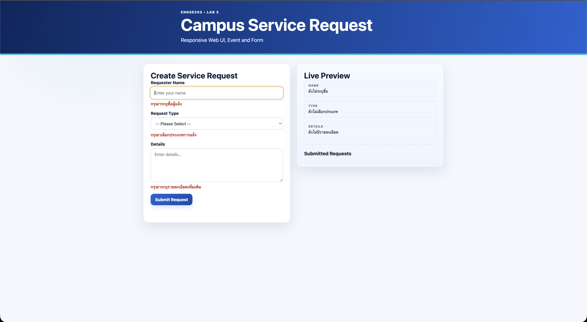
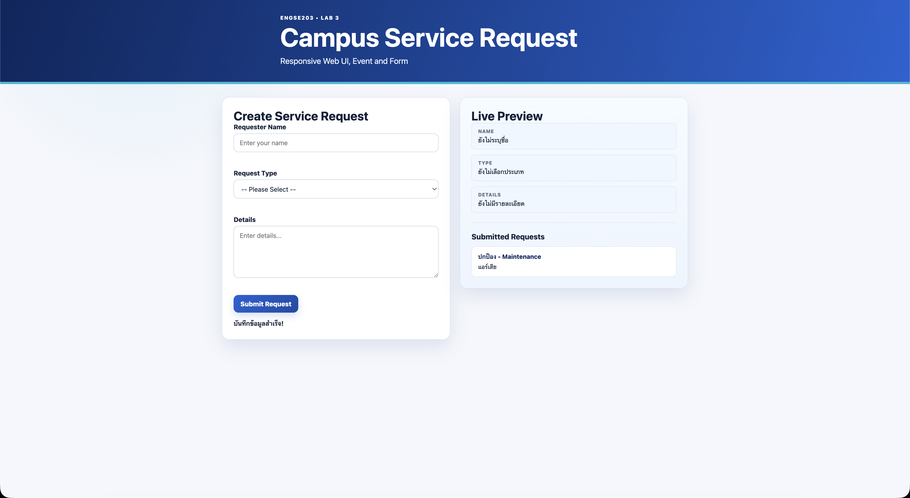

# ENGSE203 LAB 03 — Campus Service Request

**ชื่อ-นามสกุล:** ธนรัก ชุ่มสวัสดิ์ (Thanarak Chumsawat)  
**รหัสนักศึกษา:** 68543210018-6  
**รายวิชา:** ENGSE203 Software Engineering Practice (Week 03)  

---

## 📌 คำอธิบายโปรเจกต์ (Project Overview)

แล็บนี้เป็นการพัฒนาเว็บแอปพลิเคชันระบบแจ้งซ่อมและบริการภายในวิทยาเขต (**Campus Service Request**) โดยมุ่งเน้นการสร้าง **Responsive Web UI** และการจัดการ **Form Interaction** ร่วมกับ **Modern JavaScript (ES Modules)**

### ฟีเจอร์หลัก (Key Features)
- **Responsive Layout (Mobile-First):** แสดงผล 1 คอลัมน์บนหน้าจอมือถือ (375px) และขยายเป็น 2 คอลัมน์สมมาตรบนหน้าจอ Desktop (`min-width: 48rem`)
- **Real-Time Live Preview:** แสดงผลตัวอย่างข้อมูลทันทีขณะพิมพ์ผ่าน `input` event (`Requester Name`, `Request Type`, `Details`)
- **Form Validation & Focus Management:** ดักจับข้อมูลที่ไม่สมบูรณ์เมื่อกด Submit พร้อมย้าย Focus ไปยังอินพุตแรกที่มีปัญหา และแสดงข้อความเตือนใต้ช่องอินพุต
- **DOM Security & XSS Prevention:** เพิ่มรายการแจ้งบริการที่ผ่านการตรวจสอบลงใน DOM (`#request-list`) อย่างปลอดภัยด้วย `textContent`
- **Accessibility Friendly:** รองรับ `aria-describedby` และ `aria-live="polite"` สำหรับ Screen Reader

---

## 📂 โครงสร้างโปรเจกต์ (Project Structure)

```text
engse203-lab03-68543210018-6/
├── index.html              # ไฟล์ HTML หลัก โครงสร้างหน้าเว็บระบบแจ้งซ่อม
├── package.json            # ไฟล์กำหนด Dependencies และ Scripts (dev, build, check)
├── package-lock.json       # ไฟล์ล็อกเวอร์ชันของ Packages
├── README.md               # เอกสารอธิบายโปรเจกต์และสรุปผลการทดสอบหลัก
├── .gitignore              # ไฟล์ยกเว้นการติดตามของ Git
├── src/                    # โฟลเดอร์ซอร์สโค้ดหลัก
│   ├── main.js             # JavaScript logic (Form Validation, Live Preview, DOM Manipulation)
│   └── style.css           # ไฟล์ CSS กำหนด Design System, Variables และ Responsive Grid Layout
└── evidence/               # โฟลเดอร์เก็บหลักฐานการทดสอบและเอกสารสรุปผล
    ├── README.md           # รายงานสรุปผลการทดสอบและ Reflection
    ├── desktop-view.png    # ภาพหลักฐานการแสดงผลบน Desktop (2 Columns)
    ├── mobile-view.png     # ภาพหลักฐานการแสดงผลบน Mobile (375px)
    ├── form-invalid-state.png # ภาพหลักฐานแสดง Form Validation Error
    └── form-valid-state.png   # ภาพหลักฐานแสดงการบันทึกสำเร็จและการแสดงผลพรีวิว
```

---

## 🚀 วิธีการรันโปรแกรม (How to Run)

### 1. การสลับและตรวจสอบสภาวะแวดล้อม (Environment)
```bash
nvm use 22
```

### 2. ติดตั้ง Dependencies
```bash
npm install
```

### 3. รันในโหมดพัฒนา (Development Mode)
```bash
npm run dev
```
เปิดใช้งานระบบผ่าน URLs:
- **Local Dev Server:** `http://localhost:5173/` (หรือพอร์ตที่ Vite กำหนด เช่น `http://localhost:5175/`)

### 4. ตรวจสอบความถูกต้องไวยากรณ์ (Syntax Check)
```bash
npm run check
```

### 5. Build สำหรับ Production & Deploy
```bash
npm run build
```
เปิดทดสอบ Production Build ด้วย Vite Preview:
```bash
npm run preview
```
- **Local Preview Server:** `http://localhost:4173/`

สำหรับการ Publish สู่ Student Central Repository Root:
```bash
npm run import:publish -- week-03 labs/week-03/source/dist
npm run build:pages
```

---

## 🧪 ผลการทดสอบ (Test Evidence & Results)

| Test ID | Test Description | Expected Result | Result | Evidence Image |
| :--- | :--- | :--- | :--- | :--- |
| **TC-01** | **Desktop Responsive Layout** | Grid layout displays 2 columns (Form on left, Preview on right) smoothly above 768px (`min-width: 48rem`). | **PASS** |  |
| **TC-02** | **Mobile 375px Responsive Layout** | Grid layout adjusts to single column without horizontal scroll bar (`overflow-x: hidden`). | **PASS** |  |
| **TC-03** | **Form Validation (Invalid)** | Submitting empty form displays error messages under input fields and moves focus to first invalid element. | **PASS** |  |
| **TC-04** | **Live Preview & Valid Submission** | Live preview updates real-time while typing. Submitting valid form displays success message, resets form, and appends item to Submitted Requests. | **PASS** |  |

---

## 📸 ภาพหลักฐานการทดสอบ (Screenshots)

### 1. Desktop View (2 Columns Layout - 48rem+)


### 2. Mobile View (Single Column Layout - 375px Viewport)


### 3. Form Validation Errors (Invalid Form State)


### 4. Valid Submission & Live Preview (Valid Form State)


---

## 🔗 URLs

- **Development Server:** [http://localhost:5173/](http://localhost:5173/)
- **Vite Preview Server:** [http://localhost:4173/](http://localhost:4173/)

---

## 🤖 AI Disclosure (การเปิดเผยการใช้งาน AI)

- **AI Assistant Used:** Antigravity AI (Google DeepMind - Gemini 3.6 Flash)
 **Documentation:** เรียบเรียงเอกสาร `README.md` และ `evidence/README.md` สรุปผลการทดสอบ โครงสร้าง Project Structure และขั้นตอนการรันระบบอย่างสมบูรณ์
