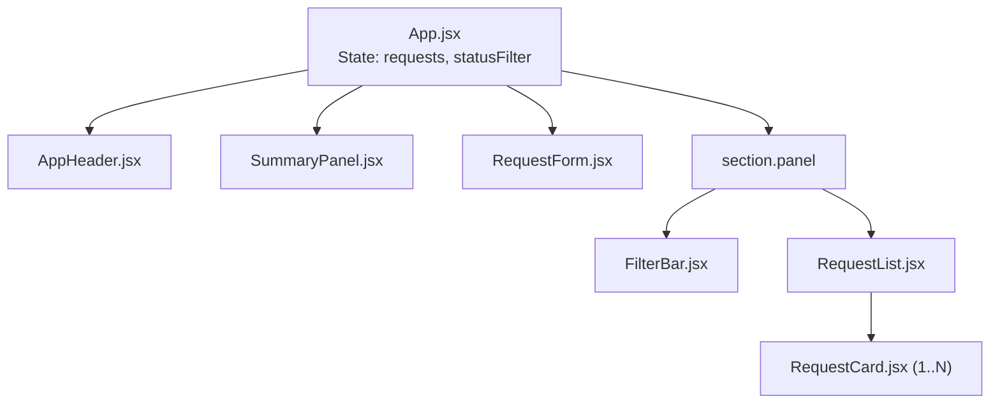
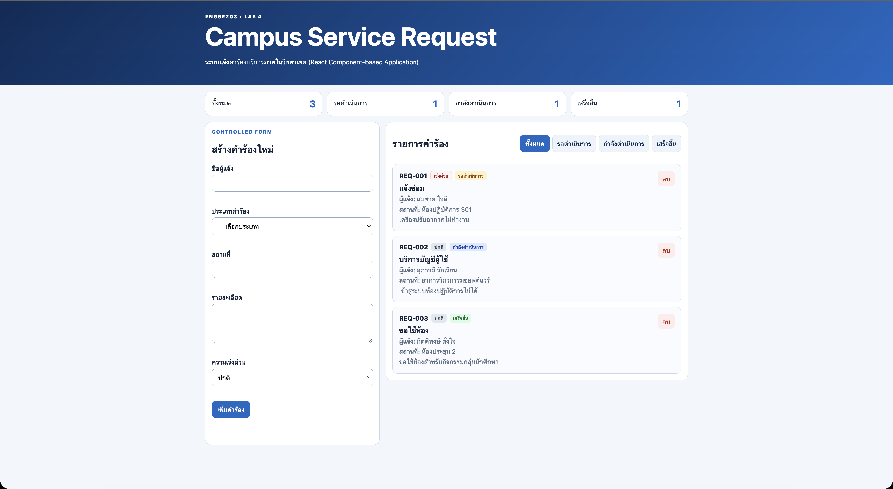
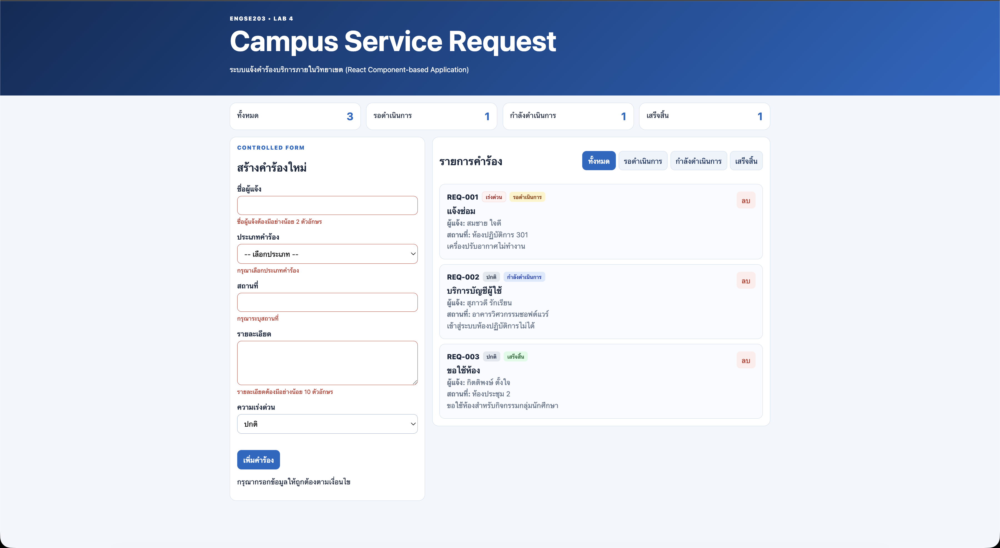
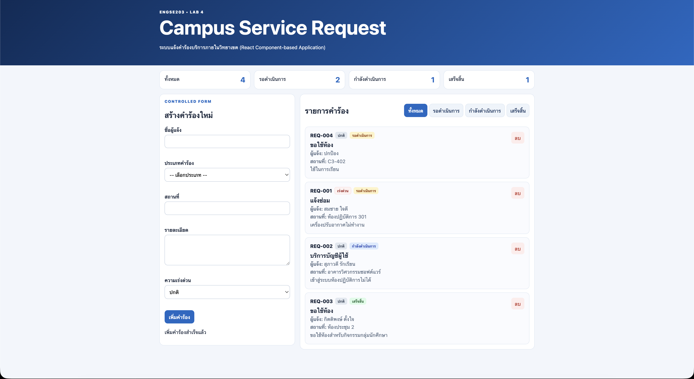
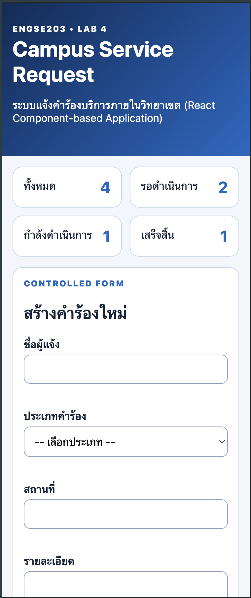

# ENGSE203 LAB 4 — React Campus Service Request

## 👤 ข้อมูลผู้เรียน (Student Information)

- **ชื่อ-นามสกุล:** ธนรัก ชุ่มสวัสดิ์  
- **รหัสนักศึกษา:** 68543210018ขุ  
- **Section:** SEC2  
- **วิชา:** ENGSE203 Software Engineering  

---

## React Component Tree (โครงสร้างส่วนประกอบ)

แอปพลิเคชันถูกออกแบบตามหลักการ **React Component-based Architecture** และ **Controlled Components** โดยมีลำดับชั้นและการส่งต่อ Props ดังนี้:

```text
App (src/App.jsx) [Root Component - Manages 'requests' & 'statusFilter' states]
│
├── AppHeader (src/components/AppHeader.jsx)
│     └── [Props: title, subtitle]
│
└── main.container.page-content
      ├── SummaryPanel (src/components/SummaryPanel.jsx)
      │     └── [Props: summary (total, pending, inProgress, completed)]
      │
      └── div.workspace-grid
            ├── RequestForm (src/components/RequestForm.jsx)
            │     └── [Props: onAddRequest]
            │
            └── section.panel
                  ├── FilterBar (src/components/FilterBar.jsx)
                  │     └── [Props: value, onFilterChange]
                  │
                  └── RequestList (src/components/RequestList.jsx)
                        │     └── [Props: requests, onDeleteRequest]
                        │
                        └── RequestCard (src/components/RequestCard.jsx) [1..N]
                              └── [Props: request, onDeleteRequest]
```

### Component Hierarchy Diagram (Mermaid)



---

## 🚀 วิธีการรันโครงการ (How to Run)

### 1. การติดตั้ง Dependencies
```bash
npm install
```

### 2. รันในโหมด Development
```bash
npm run dev
```
เปิดเบราว์เซอร์และเข้าไปที่ `http://localhost:5173`

### 3. ตรวจสอบคุณภาพโค้ด (Build Check)
```bash
npm run build
```


---

## Test Evidence (สรุปผลการทดสอบ TC-01 ถึง TC-12)

| Test ID | Scenario | Expected Result | Actual Result | Status | Evidence |
|---|---|---|---|---|---|
| **TC-01** | Initial render | Render คำร้องเริ่มต้น 3 รายการ และ Summary แสดง (Total: 3, Pending: 1, In-Progress: 1, Completed: 1) โดยไม่มี error ใน console | แสดงคำร้อง 3 รายการ และสรุปจำนวนถูกต้อง ตรงตาม initialRequests | **PASS** | `evidence/desktop.png` |
| **TC-02** | Controlled input | ทุก input field (ชื่อ, ประเภท, สถานที่, รายละเอียด, priority) เปลี่ยนตาม React state (`formData`) | แบบฟอร์มตอบสนองทันทีตาม state ทุก field | **PASS** | `evidence/desktop.png` |
| **TC-03** | Invalid submit | เมื่อส่งแบบฟอร์มที่ไม่ผ่านกฎ validation จะไม่เพิ่มรายการ แสดงข้อความ error ใกล้ field และตั้ง `aria-invalid="true"` | ไม่เพิ่มรายการ แสดง error สีแดงใกล้ field และ input มีขอบสีแดงพร้อม aria-invalid | **PASS** | `evidence/validation-error.png` |
| **TC-04** | Valid submit | เมื่อกรอกข้อมูลถูกต้องและเพิ่มคำร้อง คำร้องใหม่จะอยู่ในสถานะ pending, summary เพิ่มขึ้น 1, และ reset แบบฟอร์มพร้อมแสดง feedback `role="status"` | เพิ่ม REQ-004 สถานะ pending สำเร็จ Summary total/pending เพิ่มขึ้น รูปแบบฟอร์มถูก reset | **PASS** | `evidence/success-result.png` |
| **TC-05** | Filter status | เมื่อเลือก filter แต่ละสถานะ (pending, in-progress, completed) จะแสดงเฉพาะคำร้องในสถานะที่เลือก | แสดงผลเฉพาะคำร้องในสถานะที่เลือกตรงตามปุ่ม active | **PASS** | `evidence/desktop.png` |
| **TC-06** | Return all | เมื่อเลือกปุ่ม filter "ทั้งหมด" จะแสดงคำร้องทุกสถานะ | แสดงคำร้องทั้งหมดกลับคืนมา | **PASS** | `evidence/desktop.png` |
| **TC-07** | Empty state | เมื่อเลือกสถานะที่ไม่มีรายการ หรือลบรายการจนหมด จะแสดงข้อความ empty state (`requests.length === 0`) | แสดงกล่อง empty state "ไม่พบรายการคำร้องที่ตรงตามเงื่อนไข" | **PASS** | `evidence/validation-error.png` |
| **TC-08** | Delete | เมื่อกดปุ่มลบคำร้อง คำร้องที่มี ID นั้นจะถูกลบออกด้วย immutable `.filter()`, Summary อัปเดต | คำร้องถูกลบตาม ID สรุปอัปเดตทันที รายการอื่นคงเดิม | **PASS** | `evidence/success-result.png` |
| **TC-09** | 375px responsive | UI ปรับขนาดรองรับหน้าจอสัมผัสขนาดเล็ก 375px โดยไม่มี horizontal scrollbar | Layout ปรับเป็นแนวตั้ง สวยงาม สมบูรณ์ ไม่ล้นจอ | **PASS** | `evidence/mobile-375.png` |
| **TC-10** | Keyboard accessibility | บังคับทิศทางด้วย Tab/Enter/Space บนปุ่มและแบบฟอร์มได้ถูกต้อง | Focus ring แสดงชัดเจน ปุ่มและแบบฟอร์มใช้งานด้วยคีย์บอร์ดได้ครบถ้วน | **PASS** | `evidence/desktop.png` |
| **TC-11** | Build & Check | `npm run check` และ `npm run build` ผ่าน 100% | Vite build สำเร็จโดยไม่มี error | **PASS** | Console output |
| **TC-12** | Pages Incognito | หน้ารวม Pages Hub และ Weekly Result โหลดครบถ้วนบน Incognito | โหลดสินทรัพย์ CSS/JS ถูกต้อง ไม่พบ HTTP 404 | **PASS** | Pages Hub URL |

---

## Screenshots Evidence

### 1. Desktop Interface Overview (`desktop.png`)


### 2. Form Validation Error State (`validation-error.png`)


### 3. Valid Submission & Summary Update (`success-result.png`)


### 4. Mobile 375px Responsive View (`mobile-375.png`)


---

## AI Disclosure (การเปิดเผยการใช้งานปัญญาประดิษฐ์)

ในการทำปฏิบัติการนี้ ได้ใช้ **Antigravity AI (Gemini 3.6 Flash)** เป็นผู้ช่วยในการพัฒนา (AI-Assisted Development) ดังนี้:
3. **การจัดทำเอกสารและรายงานผลการทดสอบ:**
   - ช่วยจัดทำโครงสร้างเอกสาร `README.md`, Component Tree Diagram, ตารางสรุป Test Cases (TC-01 – TC-12) และ AI Disclosure ครบถ้วนตามมาตรฐานวิชา ENGSE203
